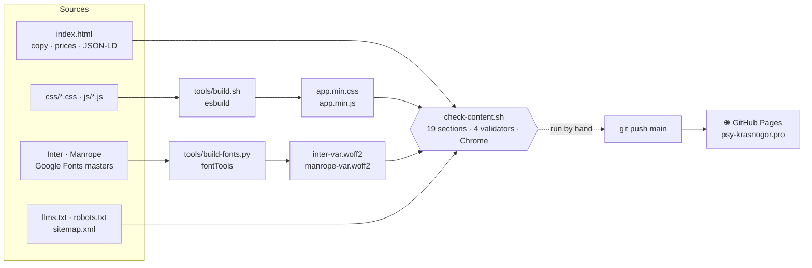

<p align="center">
  
</p>

<p align="center">
  <a href="README.md">🇷🇺 Русский</a> · <b>🇬🇧 English</b>
</p>

<p align="center">
  🌐 <a href="https://psy-krasnogor.pro"><b>psy-krasnogor.pro</b></a> — live
</p>

---

## A psychologist's website: a quiz hands over a ready request instead of a blank "hello"

**A family psychologist's private practice.** In the profession since 2016,
working in Russian — online and in person on Koh Samui, Thailand. The requests
are typical of private practice: anxiety, couple relationships, burnout,
self-esteem, crises and loss.

Clients arrive through referrals from friends and through the specialist's own
Telegram channel — bypassing search. A person gets a link, opens it and then takes
weeks to work up the courage to write. During that stretch the website is all they
have: they haven't met the specialist yet, they're too shy to ask, and they have
plenty of questions. The whole page is built around a single step — from "you were
recommended to me" to a sent message.

<table>
  <tr>
    <td align="center" width="35%">
      <br>
      <sub><b>Three answers become a ready message</b></sub>
    </td>
    <td align="center" width="65%">
      <br>
      <sub><b>Prices in rubles and baht at once</b></sub>
    </td>
  </tr>
</table>

---

## 📈 Why there are no numbers here yet

Analytics has been running since day one, but there is nothing to show yet — and
it is more honest to explain why than to pull out a pretty chart.

The site went live in May 2026. During that time there was a short paid-ads period
that had nothing to do with how the site itself works — those visits don't count.
The rest of the time visitors are few, and at that volume any conversion rate can
be counted on your fingers.

People aren't arriving from search yet either, and that is expected. For broad
queries like "online psychologist", the top of the results is held by large
directories of specialists — thousands of pages and years of domain age; a new
domain with a single page has no place there. A one-page site doesn't win those
queries and isn't meant to: its job starts once a person already has the link —
from a friend, from the channel, from a chat.

<sub>What can be checked right now, without statistics: the quiz can be completed
end to end and produces a ready message, prices on the page and in the structured
markup match, and the in-person address appears nowhere. Numbers are worth pulling
no earlier than winter 2026/27.</sub>

---

## 🎯 What the site solves for the business

**People write with a ready request, not a blank "hello".** A three-question quiz —
what do you want to work through, have you seen a psychologist before, when would
you like to start — turns the answers into a ready message: a greeting, the
request, prior experience, timing and a request to book the free twenty-minute
meeting. One button copies the text, the other opens Telegram. The person doesn't
have to put into words from scratch something that is hard to talk about, and the
specialist sees from the very first line what the person is coming with, without
spending the first meeting on figuring that out. Right under the buttons it says
the answers are not sent anywhere automatically — on a site like this, that needs
saying out loud.

**Price and schedule are clear before the first question.** Each pricing card shows
the online price in rubles and the in-person price on the island in baht, with the
session length next to them. The free twenty-minute intro meeting gets its own card
at the top: it is the first step and shouldn't get lost among the prices. Opening
hours are given in two time zones at once — island time and Moscow time: the
difference is four hours, and without the second line someone in Russia would book
a slot that doesn't exist.

**Credentials open up instead of just being listed.** Four diplomas and
certificates — a bachelor's degree in psychology, two professional retraining
programs of 620 and 1,640 hours, and an advanced course in cognitive behavioral
therapy. Each opens full-size on click and can be paged through with arrows, keys
and swipes. People let a psychologist into the most personal part of their lives,
and trust starts with credentials.

**Answers to what people are too shy to ask.** Ten frequently asked questions — not
only "how much" and "how do I book", but what people actually think: isn't it
shameful? how do I tell whether I need a psychologist rather than a psychiatrist?
what if it doesn't help and I just waste my time? what if my partner is against
couples therapy? Every answer opens with the answer, no warm-up: that makes it
faster to read — and those are exactly the fragments search engines and AI
assistants pull into their answers.

**The in-person address is guarded by a check.** The page names only the island —
no street, no building, no coordinates: not in the text, not in the structured
markup, not in the file for AI assistants. It is the client's safety requirement,
and it is written into the site's checks: they search the page and that file for
a street address and coordinates and fail if they find any. For the same reason,
session recording is switched off — the analytics option that records mouse
movements and form input. The site is about personal matters; tracking people on
it would be out of place.

**Search engines and AI assistants understand the site.** The structured markup is
one connected graph: who the specialist is, which services, prices in two
currencies, qualifications, opening hours. The schema.org validator finds zero
errors and zero warnings in it. A dedicated summary file is published for AI
systems, and such systems are explicitly allowed to crawl the site. More and more
often people ask an assistant rather than a search engine — "recommend a family
psychologist who works online" — and to make it into that answer, a site has to be
easy to quote.

**A lightweight page.** Fonts were cut down to the characters actually used on the
page: previously a single "₽" sign made the browser download a hundred kilobytes of
Vietnamese and phonetic Latin; now both fonts weigh 49 KB instead of 203. After
that, the initial page load became two and a half times lighter. Diploma scans come
in two variants — light for regular screens and detailed for retina — and the photo
on the first screen no longer holds up the text on phones, where it ends up below
the fold anyway. The heaviest file on the page isn't ours: it is the 87 KB
analytics counter. It waits until the page has rendered or the visitor does
something, and no statistics are lost in the meantime.

**Where the site was silently losing people — found and fixed.** Three failures you
won't see by opening the site and clicking around with a mouse. If the code didn't
reach the visitor — an ad blocker, a corporate proxy, a dropped mobile connection —
a blank white screen was left instead of the page. The button showed "Copied ✓"
even when copying failed, and the person went off to the messenger with an empty
message — exactly at the step the page exists for. And for people who navigate with
a keyboard, the quiz hit a dead end three times. All fixed, and it gave rise to
a separate check: a real browser walks through the site — completes the quiz, opens
the diplomas, tabs through the page, checks that the layout doesn't break on narrow
screens, and reads the error log. When the check was written, the site as it was
then failed almost all of its items: it catches real failures rather than creating
the appearance of testing.

**Figures on the site are checked before publishing.** A set of checks verifies that
prices, opening hours and work formats are in place, that the FAQ on the page
matches what search engines see, and that prices in the price list haven't drifted
from prices in the structured markup.

Two honest caveats. The checks are run by hand before changes are pushed, and they
cannot stop a publish on their own: the site updates as soon as a change lands in
the repository. And a price doesn't live in a single place on the page — besides
the price list, it is repeated in the FAQ, in the short summary about the
specialist, in the description for search engines and in the file for AI
assistants. Only the structured markup is checked against the price list; the
other mentions have to be updated along with it, by hand.

---

## 💰 What it costs the owner

| | |
|---|---|
| **Hosting** | 0 — GitHub Pages serves the pages for free; the only expense is renewing the domain |
| **Builder subscription** | none |
| **Changing a price** | a text edit, no build needed — but each price is repeated in six to eight places across the page and the AI-assistant file, and all of them must change together; the checks also remember the old figure and need updating too |
| **Shelf life** | no database, engine or plugins that need updating; build tools are only needed when styles, scripts or fonts change |
| **If the developer disappears** | the site keeps running on its own; the source is plain text files, handed over to the client on request, after which any developer can maintain the site |

---

## 🧭 What's on the site

**One page · 11 sections · 2 formats of work**, prices in rubles and baht:

| Section | What's in it |
|---|---|
| **Briefly about the specialist** | a summary at the top of the page: experience, formats, requests, methods, prices and hours — in a form that's easy to quote |
| **If this sounds like you** | six phrases people use to describe how they feel — "that's a valid reason to come" |
| **How I can help** | the requests the specialist works with: anxiety, self-esteem, relationships, crises and loss, and more |
| **Choosing a format** | a three-question quiz that ends with a ready message |
| **How the work goes** | format, session length, frequency, confidentiality |
| **My approach** | CBT, gestalt therapy, EFT, mindfulness practices |
| **About me** | education, retraining, personal therapy and supervision |
| **Documents** | four diplomas and certificates that open full-size |
| **Pricing** | a free intro meeting, individual and couple or family sessions, hours in two time zones |
| **FAQ** | ten answers to what people ask before the first meeting |
| **Contacts** | Telegram, Max and the channel, opening hours |

---

<details>
<summary><b>🔧 How it works — technical documentation</b></summary>

<p>
  
  
  
  
</p>

Technically this is **not a CMS or a page builder**, but a single static page in
plain HTML, CSS and JavaScript, with no frameworks. Copy, prices and markup are
edited directly in `index.html`; styles, scripts and fonts are assembled by short
scripts. The site is served for free from GitHub Pages on a custom domain, and
before publishing it goes through a set of checks — from prices and markup to
behavior in a real browser.

### 🛠 Tech stack

| Area | Tools |
|---|---|
| **Markup** | HTML5, one page of 11 sections; FAQ and "My approach" use native `<details>` |
| **Styles** | Plain CSS, mobile-first, BEM, every value via CSS custom properties; five files concatenated and minified into `app.min.css` (esbuild) |
| **Scripts** | Vanilla JS: `main.js` and `quiz.js` → `app.min.js` (esbuild); Metrica loaded via a separate `metrika.js` |
| **Fonts** | Self-hosted Inter + Manrope: one variable woff2 per family, subset to the site's character set (`fontTools`) |
| **Graphics** | WebP via `<picture>`, `srcset`/`sizes` for the photo and document scans, SVG icons |
| **SEO / AI data** | One JSON-LD `@graph` of 13 nodes, `sitemap.xml`, `robots.txt` explicitly allowing AI crawlers, `llms.txt` |
| **Checks** | `check-content.sh` — 19 sections; dependency-free Node validators: `check-jsonld.mjs`, `check-faq-sync.mjs`, `check-offers.mjs`, `check-behavior.mjs` (Chrome via CDP, 8 scenarios) |
| **Analytics** | Yandex.Metrica: deferred `tag.js` loading, session recording off |
| **Hosting** | GitHub Pages from the `main` branch, custom domain via `CNAME`, HTTPS enforced |

### 🏗 Architecture

There is no separate site build step: the page sits in the repository ready-made.
Scripts only concatenate styles and scripts and subset the fonts, while the checks
verify the source, the built files and the page's behavior — before pushing,
by hand.



### ✨ Key engineering decisions

- **🛟 The page doesn't stay blank if the bundle fails to arrive.** Blocks with an
  appear-on-scroll animation are hidden only while `<html>` has the `js` class, but
  the class alone isn't enough: if `app.min.js` never loads, nothing removes the
  hiding. The `<head>` carries a double safeguard — `onerror` on the script tag and
  a 5-second timer that checks for the `js-ready` class, which the first line of
  `main.js` sets.

- **📋 The copy button doesn't report failure as success.**
  `document.execCommand('copy')` returns `false` on failure instead of throwing, so
  the `catch` never fired and the button showed "Copied ✓" over an empty clipboard.
  The return value is now checked, a `navigator.clipboard` rejection is raised as an
  exception, and the visitor sees "Didn't work — the text is selected, press
  Ctrl+C".

- **⌨️ Focus is never lost.** When quiz buttons hide right under the focus, it moves
  to the current step instead of dropping to `<body>`. Anchor navigation moves focus to the section and
  updates the address via `history.pushState`. An open menu or lightbox sets
  `inert` on every direct child of `<body>` except itself, and removes it only from
  what it set it on.

- **🔒 Privacy under an automated check.** The in-person address is never published —
  only the island. `check-content.sh` searches `index.html` and `llms.txt` for
  `streetAddress`, `geo`, `latitude`, `longitude` and `GeoCoordinates`. Session
  recording parameters were removed from the Metrica init: the code and the counter
  settings now match, and such options can only be switched on as a pair.

- **🔎 A connected markup graph.** One JSON-LD `@graph` of 13 nodes linked via `@id`:
  `WebSite`, `WebPage`, `Person`, `ProfessionalService`, `Place`, two `Service`
  nodes, five `Offer` nodes in rubles and baht, `FAQPage`. `check-offers.mjs` reads
  the price list from the `#pricing` section and checks the offers against it;
  `check-faq-sync.mjs` checks the visible FAQ against `FAQPage`. The privacy policy
  is closed with `noindex` rather than `Disallow`: a crawler never downloads a page
  disallowed in `robots.txt` and so never reads its meta tag, which means the URL
  could still end up in search results.

- **🔤 Fonts fitted to the site's character set.** The "₽" sign (U+20BD) falls into
  the latin-ext range, so for its sake the browser pulled the full latin-ext subsets
  of Inter and Manrope — 883 glyphs of Vietnamese and phonetic Latin, in a second
  wave, right in the LCP render window. Instead of eight `unicode-range` slices
  there is now one woff2 per family with only the glyphs and weights in use:
  48.8 KB instead of 202.9 KB, font requests 6 → 2. Page weight over gzip after
  that — 291.4 → 118.2 KB, requests 19 → 11 (measured 22 Aug 2026).

- **⚡ Metrica off the critical path.** `tag.js` — 87 KB, the heaviest file on the
  page — is injected on browser idle or on the visitor's first interaction. The
  `ym` queue stays synchronous: with a naive `defer`, goals in `main.js` and
  `quiz.js` would silently disappear. "Automatic goals" were switched off along with
  `tag_phono.js`, and Tag Manager along with its request to `cdn.jsdelivr.net`: the
  Yandex Webmaster ownership check moved to a static meta tag. Third-party requests
  went from 6 totaling 105,198 bytes to 4 totaling 88,984 bytes.

- **🖼 Images sized to the screen.** Diploma previews were rebuilt as WebP `-q 75`
  with a 400 px variant via `srcset`/`sizes`: desktop 570 → 363 KB, retina mobile
  599 → 514 KB at the same sharpness. The lightbox switched to WebP. On phones the
  hero photo starts below the fold, so it left the critical path: `media` on the
  preload plus `loading="lazy"` — and it no longer competes with the fonts for the
  connection.

- **🧪 Checks that can't agree with themselves.** The date in `sitemap.xml` is
  compared against the last git change to `index.html`, not a constant.
  `check-offers.mjs` reads prices from the page, not from itself. Built `*.min.*`
  files carry a fingerprint of their sources — editing a source without rebuilding
  gets caught.

- **🔐 HTTPS only.** GitHub Pages doesn't enforce HTTPS by itself: the certificate was
  approved while `https_enforced` stayed `false`, and the site answered over HTTP
  with no redirect — hence a duplicate host in Yandex Webmaster. Now enforced,
  HTTP returns 301.

### 📁 Project structure

```
.
├─ index.html                 # the whole page: copy, prices, JSON-LD
├─ pages/privacy.html         # privacy policy (noindex)
├─ css/                       # style sources + built app.min.css, legal.min.css
├─ js/                        # main.js, quiz.js, metrika.js + built app.min.js
├─ fonts/                     # inter-var.woff2, manrope-var.woff2
├─ img/                       # photo, document scans, 1200×630 link preview
├─ llms.txt · robots.txt · sitemap.xml · CNAME
├─ favicon.svg · apple-touch-icon.png
│
├─ tools/
│  ├─ build.sh                #   CSS and JS concatenation and minification (esbuild)
│  ├─ build-fonts.py          #   fonts fitted to the site's character set (fontTools)
│  ├─ check-content.sh        #   pre-publish checks, 19 sections
│  ├─ check-jsonld.mjs        #   JSON-LD parses without errors
│  ├─ check-faq-sync.mjs      #   visible FAQ matches FAQPage
│  ├─ check-offers.mjs        #   markup offers match the price list
│  └─ check-behavior.mjs      #   behavior in a real Chrome, 8 scenarios
│
├─ docs/                      # SEO and GEO spec, plan and report; README images
├─ JOURNAL.md                 # decisions and pitfalls
└─ _config.yml                # what GitHub Pages doesn't publish
```

### 🚀 Updating the site

Copy, prices and markup are edited directly in `index.html` — no build needed.
A price is repeated in several places: the pricing card, the JSON-LD offers, the
FAQ (both visible and `FAQPage`), the `#summary` block, the `meta description` and
`llms.txt` — change them all at once. The price-list figures are also written into
`tools/check-content.sh`, and the date in `sitemap.xml` must not lag behind the
page edit.

```bash
# Styles or scripts: sources are css/*.css and js/*.js, the browser loads the built *.min.*
bash tools/build.sh

# A new character appeared on the site (currency, arrow, another alphabet) — rebuild the fonts
python3 -m venv .venv && .venv/bin/pip install fonttools brotli
.venv/bin/python tools/build-fonts.py

# Before publishing
bash tools/check-content.sh

# Local preview
python3 -m http.server 8000
# → http://localhost:8000
```

The character set is defined by the `CHARSET` list at the top of
`tools/build-fonts.py` — it already covers all of Cyrillic plus spare typography,
so ordinary copy edits don't break the fonts. The last section of the checks runs
the site in a real Chrome; without Chrome that section skips itself and doesn't fail
the run, but the site's behavior then stays unchecked. It can be run on its own:
`node tools/check-behavior.mjs`.

### ☁️ Publishing

Push to `main` and GitHub Pages publishes the branch itself. The built-in Jekyll
only drops service files listed in `_config.yml`: `docs/`, `tools/`, `JOURNAL.md`
and both READMEs are in the repository but not on the site. The `psy-krasnogor.pro`
domain is wired up via `CNAME`, HTTPS is enforced.

**The checks are not built into publishing.** `check-content.sh` is run by hand
before pushing; a failing check won't stop the push, and whatever was pushed goes
live.

</details>

---

<p align="center">
  <sub>Development and design — jw-dev.pro. Photo and document scans — the specialist's own materials.</sub>
</p>
