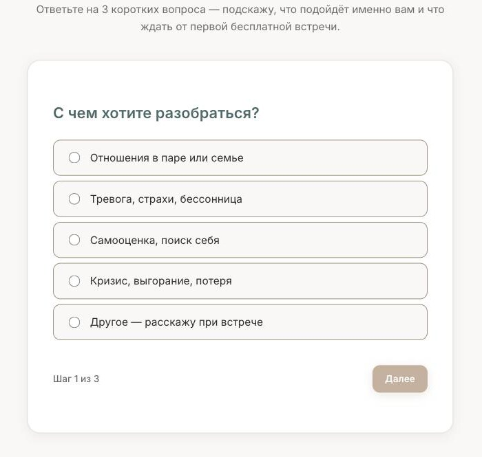
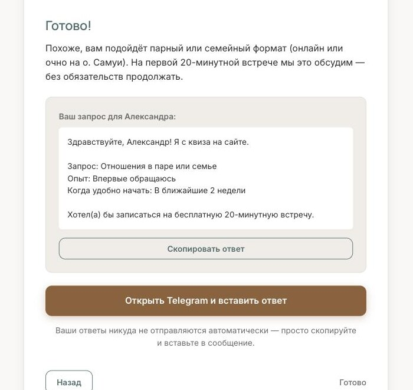
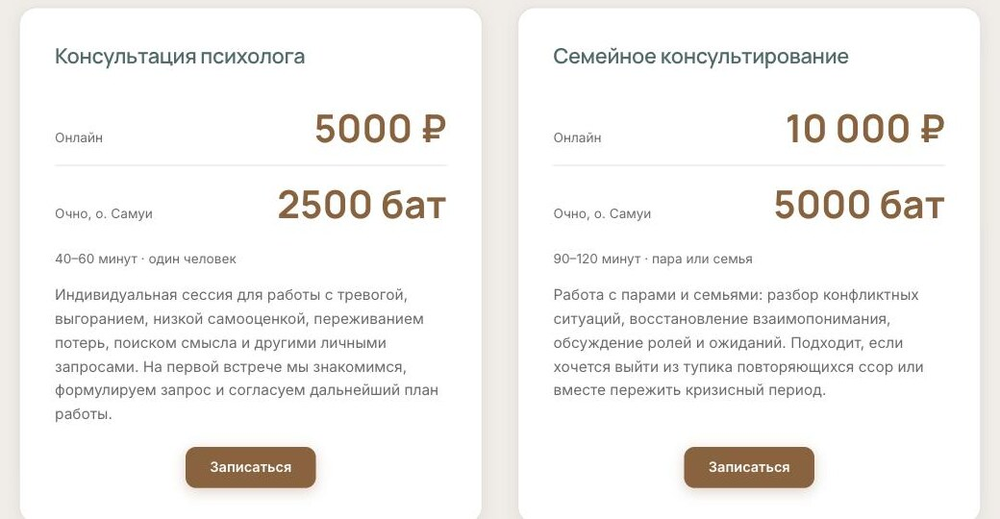
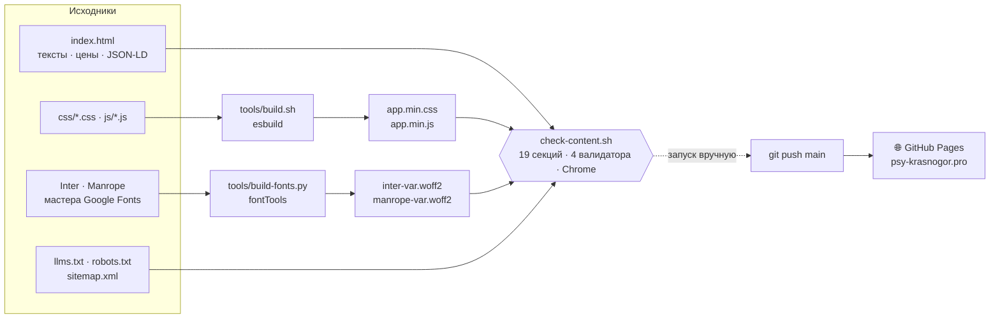

<p align="center">
  
</p>

<p align="center">
  <b>🇷🇺 Русский</b> · <a href="README.en.md">🇬🇧 English</a>
</p>

<p align="center">
  🌐 <a href="https://psy-krasnogor.pro"><b>psy-krasnogor.pro</b></a> — сайт работает
</p>

---

## Сайт психолога: квиз приносит готовый запрос вместо пустого «здравствуйте»

**Частная практика семейного психолога.** В профессии с 2016 года, работает
на русском языке — онлайн и очно на острове Самуи в Таиланде. Запросы обычные
для частной практики: тревога, отношения в паре, выгорание, самооценка, кризисы
и потери.

Клиенты приходят по рекомендации знакомых и из телеграм-канала специалиста —
мимо поиска. Человек получает ссылку, открывает её и неделями решается написать.
На этом отрезке сайт — единственное, что у него есть: специалиста он ещё
не видел, спросить стесняется, а вопросов много. Вся страница построена вокруг
одного шага — от «мне вас посоветовали» до отправленного сообщения.

<table>
  <tr>
    <td align="center" width="35%">
      <br>
      <sub><b>Три ответа — готовое сообщение</b></sub>
    </td>
    <td align="center" width="65%">
      <br>
      <sub><b>Цены сразу в рублях и батах</b></sub>
    </td>
  </tr>
</table>

---

## 📈 Почему здесь пока нет цифр

Аналитика стоит с первого дня, но показывать пока нечего — и честнее объяснить
почему, чем достать красивый график.

Сайт открыт в мае 2026 года. За это время был короткий рекламный период,
к работе самого сайта отношения не имеющий, — эти визиты в счёт не идут.
В остальное время посетителей немного, и на таком объёме любая конверсия
считается пальцами.

Из поиска люди тоже пока не идут, и это ожидаемо. По общим запросам вроде
«психолог онлайн» верх выдачи держат крупные каталоги специалистов — тысячи
страниц и годы возраста; новому домену с одной страницей там места нет.
Одностраничная визитка такие запросы не берёт и не должна: её работа
начинается, когда человек уже получил ссылку — от знакомого, из канала,
из переписки.

<sub>Что можно проверить уже сейчас, без статистики: квиз проходится до конца
и выдаёт готовое сообщение, цены на странице и в служебной разметке сходятся,
адреса очного приёма нет нигде. Цифры имеет смысл снимать не раньше зимы
2026/27.</sub>

---

## 🎯 Что сайт решает для бизнеса

**Человек пишет с готовым запросом, а не с пустым «здравствуйте».** Квиз из трёх
вопросов — с чем хотите разобраться, был ли опыт работы с психологом, когда
удобно начать — собирает ответы в готовый текст: приветствие, запрос, опыт,
сроки и просьба записаться на бесплатную двадцатиминутную встречу. Одна кнопка
копирует текст, вторая открывает Telegram. Человеку не нужно с нуля
формулировать то, о чём тяжело говорить, а специалист с первой строки видит,
с чем к нему идут, и не тратит первую встречу на выяснение запроса. Под кнопками
прямо сказано, что ответы никуда не отправляются автоматически, — на таком сайте
это важно сказать вслух.

**Цена и время понятны до первого вопроса.** В каждой карточке прайса — цена
онлайн в рублях и очно на острове в батах, рядом длительность. Бесплатное
двадцатиминутное знакомство стоит отдельной карточкой сверху: это первый шаг,
и он не должен теряться среди цен. Часы приёма указаны сразу в двух поясах —
по времени острова и по Москве: разница четыре часа, и без второй строки
человек из России записался бы на время, которого нет.

**Документы открываются, а не перечисляются.** Четыре диплома и сертификата —
бакалавр психологии, две профессиональные переподготовки на 620 и 1640 часов
и повышение квалификации по когнитивно-поведенческой терапии. Каждый открывается
по клику в полном размере и листается стрелками, клавишами и свайпом. Психолога
пускают в самое личное, и доверие к нему начинается с документов.

**Ответы на то, что стесняются спросить.** Десять частых вопросов — не только
«сколько стоит» и «как записаться», но и то, что человек думает на самом деле:
это не стыдно? как понять, что мне нужен психолог, а не психиатр? а вдруг
не поможет — я просто потеряю время? что если партнёр против парной терапии?
Каждый ответ начинается с ответа, без разгона: так его быстрее прочитать —
и ровно такие фрагменты забирают в свою выдачу поисковики и ИИ-ассистенты.

**Адрес очного приёма закрыт проверкой.** На странице указан только остров —
ни улицы, ни дома, ни координат: ни в тексте, ни в служебной разметке, ни в файле
для ИИ-ассистентов. Это требование заказчика по безопасности, и оно записано
в проверки сайта: они ищут в странице и в этом файле улицу и координаты и не
проходят, если что-то нашли. По той же причине на сайте выключена запись
действий посетителей — опция аналитики, которая пишет движения мыши и заполнение
полей. Сайт о личном, следить на нём за людьми лишнее.

**Сайт понятен поисковикам и ИИ-ассистентам.** Служебная разметка собрана в один
связный граф: кто специалист, какие услуги, цены в двух валютах, квалификация,
часы приёма. Валидатор schema.org не находит в ней ни одной ошибки
и предупреждения. Для ИИ-систем лежит отдельный файл-выжимка, и таким системам
явно разрешён доступ к сайту. Всё чаще человек спрашивает не поисковик,
а ассистента — «посоветуй семейного психолога, который работает онлайн», —
и чтобы попасть в такой ответ, сайт должен быть удобен для цитирования.

**Страница лёгкая.** Шрифты урезаны до символов, которые на ней действительно
есть: раньше из-за одного знака «₽» браузер докачивал сотню килобайт вьетнамской
и фонетической латиницы, теперь оба шрифта весят 49 КБ вместо 203. После этого
первая загрузка страницы стала в два с половиной раза легче. Сканы дипломов
отдаются в двух вариантах — лёгком для обычного экрана и подробном для retina, —
а фото с первого экрана не задерживает текст на телефонах, где оно всё равно
оказывается ниже сгиба. Самый тяжёлый файл страницы — не наш: это счётчик
аналитики на 87 КБ. Он ждёт, пока страница отрисуется или человек что-нибудь
нажмёт, и статистика при этом не теряется.

**Где сайт молча терял людей — найдено и закрыто.** Три поломки, которых
не увидеть, если открыть сайт и прокликать мышью. Если код не доезжал
до посетителя — блокировщик рекламы, корпоративный прокси, оборванный мобильный
интернет, — вместо страницы оставался белый экран. Кнопка показывала
«Скопировано ✓», даже когда скопировать не вышло, и человек уходил в мессенджер
с пустым сообщением — ровно на том шаге, ради которого страница сделана.
А у тех, кто ходит по странице с клавиатуры, квиз трижды упирался в тупик.
Всё починено, и из этого выросла отдельная проверка: по сайту проходит настоящий
браузер — проходит квиз до конца, открывает дипломы, идёт по странице
с клавиатуры, смотрит, не разъезжается ли вёрстка на узких экранах, и читает
журнал ошибок. Когда её написали, тогдашний сайт провалил почти все её пункты:
она ловит настоящие поломки, а не создаёт видимость.

**Цифры на сайте сверяются перед публикацией.** Набор проверок смотрит, на месте
ли цены, часы приёма и форматы работы, совпадают ли частые вопросы на странице
с тем, что видит поисковик, и не разошлась ли цена в прайсе с ценой в служебной
разметке.

Две честные оговорки. Проверки запускаются вручную, перед отправкой правок,
и сами остановить публикацию не могут: сайт обновляется сразу, как только правка
попала в репозиторий. И цена стоит на странице не в одном месте — кроме прайса,
она повторяется в частых вопросах, в краткой выжимке о специалисте, в описании
для поисковиков и в файле для ИИ-ассистентов. С прайсом проверки сверяют только
служебную разметку; остальные упоминания правятся вместе с ним, руками.

---

## 💰 Что стоит владельцу

| | |
|---|---|
| **Хостинг** | 0 — страницы бесплатно раздаёт GitHub Pages; из расходов только продление домена |
| **Абонентская плата за конструктор** | нет |
| **Смена цены** | правка текста, сборка не нужна — но каждая цена повторяется в шести–восьми местах страницы и файла для ИИ-ассистентов, и менять их нужно все вместе; проверки при этом помнят прежнюю цифру, их тоже придётся поправить |
| **Срок жизни** | ни базы данных, ни движка, ни плагинов, которые нужно обновлять; инструменты сборки нужны, только когда меняются стили, скрипты или шрифты |
| **Если разработчик пропадёт** | сайт продолжит работать сам; исходники — обычные текстовые файлы, по желанию заказчика передаются ему, и дальше сайт может вести любой разработчик |

---

## 🧭 Что на сайте

**Одна страница · 11 блоков · 2 формата работы**, цены в рублях и батах:

| Блок | Что в нём |
|---|---|
| **Коротко о специалисте** | выжимка в начале страницы: опыт, форматы, запросы, методы, цены и часы — в форме, удобной для цитирования |
| **Если узнаёте себя** | шесть фраз, которыми люди описывают своё состояние, — «это рабочий запрос» |
| **Чем я могу помочь** | запросы, с которыми работает специалист: тревога, самооценка, отношения, кризисы и потери и другие |
| **Подбор формата** | квиз из трёх вопросов, на выходе — готовое сообщение |
| **Как проходит работа** | формат, длительность, периодичность, конфиденциальность |
| **Мой подход** | КПТ, гештальт-терапия, ЭФТ, практики осознанности |
| **Обо мне** | образование, переподготовка, личная терапия и супервизия |
| **Документы** | четыре диплома и сертификата, открываются в полном размере |
| **Стоимость** | бесплатное знакомство, индивидуальная и семейная консультация, часы в двух поясах |
| **Частые вопросы** | десять ответов на то, что спрашивают до первой встречи |
| **Контакты** | Telegram, Max и канал, часы приёма |

---

<details>
<summary><b>🔧 Как это устроено — техническая документация</b></summary>

<p>
  
  
  
  
</p>

Технически это **не CMS и не конструктор**, а одна статическая страница на чистых
HTML, CSS и JavaScript, без фреймворков. Тексты, цены и разметка правятся прямо
в `index.html`; стили, скрипты и шрифты собираются короткими скриптами. Сайт
бесплатно раздаётся через GitHub Pages на своём домене, а перед публикацией его
прогоняет набор проверок — от цен и разметки до поведения в настоящем браузере.

### 🛠 Технологии

| Область | Инструменты |
|---|---|
| **Разметка** | HTML5, одна страница из 11 секций; FAQ и «Мой подход» — на нативных `<details>` |
| **Стили** | Чистый CSS, mobile-first, БЭМ, все значения через CSS-переменные; пять файлов склеиваются и минифицируются в `app.min.css` (esbuild) |
| **Скрипты** | Vanilla JS: `main.js` и `quiz.js` → `app.min.js` (esbuild); Метрика — отдельным `metrika.js` |
| **Шрифты** | Самохостинг Inter + Manrope: по одному вариативному woff2 на семейство, урезанному под набор символов сайта (`fontTools`) |
| **Графика** | WebP через `<picture>`, `srcset`/`sizes` для фото и сканов документов, SVG-иконки |
| **SEO / данные для ИИ** | Один JSON-LD `@graph` из 13 узлов, `sitemap.xml`, `robots.txt` с явным доступом ИИ-краулерам, `llms.txt` |
| **Проверки** | `check-content.sh` — 19 секций; Node-валидаторы без зависимостей: `check-jsonld.mjs`, `check-faq-sync.mjs`, `check-offers.mjs`, `check-behavior.mjs` (Chrome через CDP, 8 сценариев) |
| **Аналитика** | Яндекс.Метрика: отложенная загрузка `tag.js`, запись сессий выключена |
| **Хостинг** | GitHub Pages из ветки `main`, домен через `CNAME`, принудительный HTTPS |

### 🏗 Архитектура

Отдельного шага сборки сайта нет: страница лежит в репозитории готовой. Скрипты
только склеивают стили и скрипты и режут шрифты, а проверки сверяют исходник,
собранные файлы и поведение страницы — перед пушем, вручную.



### ✨ Ключевые инженерные решения

- **🛟 Страница не остаётся пустой, если бандл не доехал.** Блоки с анимацией
  появления скрыты только при классе `js` на `<html>`, но одного класса мало:
  если `app.min.js` не загрузился, снять скрытие некому. В `<head>` стоит двойная
  страховка — `onerror` на теге скрипта и таймер на 5 секунд, который проверяет
  класс `js-ready`; его выставляет первая строка `main.js`.

- **📋 Кнопка копирования не выдаёт отказ за успех.** `document.execCommand('copy')`
  при отказе возвращает `false`, а не бросает исключение, поэтому `catch`
  не срабатывал и кнопка показывала «Скопировано ✓» на пустом буфере. Теперь
  возврат проверяется, отказ `navigator.clipboard` поднимается исключением,
  а человек видит «Не вышло — текст выделен, нажмите Ctrl+C».

- **⌨️ Фокус не теряется.** Когда кнопки квиза прячутся прямо под фокусом, он
  переносится на текущий шаг, а не падает на `<body>`. Якорная навигация переносит фокус на секцию и пишет
  адрес через `history.pushState`. Открытые меню и лайтбокс ставят `inert` на всех
  прямых детей `<body>`, кроме себя, и снимают его только с того, чему поставили
  сами.

- **🔒 Приватность под проверкой.** Адрес очного приёма не публикуется нигде —
  только уровень острова. `check-content.sh` ищет `streetAddress`, `geo`,
  `latitude`, `longitude` и `GeoCoordinates` в `index.html` и в `llms.txt`.
  Параметры записи сессий убраны из инициализации Метрики: код и настройки
  счётчика совпадают, и включать такие опции можно только парой.

- **🔎 Связный граф разметки.** Один JSON-LD `@graph` из 13 узлов со ссылками
  через `@id`: `WebSite`, `WebPage`, `Person`, `ProfessionalService`, `Place`,
  два `Service`, пять `Offer` в рублях и батах, `FAQPage`. `check-offers.mjs`
  читает прайс из секции `#pricing` и сверяет с ним офферы, `check-faq-sync.mjs` —
  видимый FAQ с `FAQPage`. Политика конфиденциальности закрыта `noindex`,
  а не `Disallow`: запрещённую в `robots.txt` страницу краулер не скачивает
  и мета-тег не читает, так что URL всё равно мог бы попасть в выдачу.

- **🔤 Шрифты под набор символов сайта.** Знак «₽» (U+20BD) попадает в диапазон
  latin-ext, и браузер ради него докачивал полные latin-ext-подмножества Inter
  и Manrope — 883 глифа вьетнамской и фонетической латиницы, второй волной, в окно
  отрисовки LCP. Вместо восьми нарезок по `unicode-range` — по одному woff2
  на семейство, только нужные глифы и насыщенности: 48,8 КБ вместо 202,9 КБ,
  запросов за шрифтами 6 → 2. Вес страницы по gzip после этого — 291,4 → 118,2 КБ,
  запросов 19 → 11 (замер 22.08.2026).

- **⚡ Метрика не на критическом пути.** `tag.js` на 87 КБ — самый тяжёлый файл
  страницы — вставляется по простою браузера или первому действию человека.
  Очередь `ym` осталась синхронной: цели в `main.js` и `quiz.js` при наивном
  `defer` молча пропали бы. «Автоматические цели» выключены вместе
  с `tag_phono.js`, Тег менеджер — вместе с запросом к `cdn.jsdelivr.net`:
  подтверждение прав в Вебмастере переехало в статический мета-тег. Сторонних
  запросов было 6 на 105 198 б, стало 4 на 88 984 б.

- **🖼 Картинки по экрану.** Превью дипломов пересобраны в WebP `-q 75` с вариантом
  400 px через `srcset`/`sizes`: десктоп 570 → 363 КБ, retina-мобильный
  599 → 514 КБ при той же резкости. Лайтбокс переведён на WebP. Hero-фото
  на телефонах начинается ниже сгиба, поэтому ушло с критического пути: `media`
  на preload плюс `loading="lazy"` — и больше не отнимает канал у шрифтов.

- **🧪 Проверки, которые не сходятся сами с собой.** Дата в `sitemap.xml`
  сверяется с датой правки `index.html` по git, а не с константой.
  `check-offers.mjs` читает прайс со страницы, а не из себя. Собранные `*.min.*`
  несут отпечаток исходников — правка исходника без пересборки ловится.

- **🔐 Только HTTPS.** GitHub Pages сам принудительный HTTPS не включает:
  сертификат был одобрен, а `https_enforced` стоял в `false`, и сайт отвечал
  по HTTP без редиректа — отсюда был дубль хоста в Вебмастере. Включено,
  HTTP отдаёт 301.

### 📁 Структура проекта

```
.
├─ index.html                 # вся страница: тексты, цены, JSON-LD
├─ pages/privacy.html         # политика конфиденциальности (noindex)
├─ css/                       # исходники стилей + собранные app.min.css, legal.min.css
├─ js/                        # main.js, quiz.js, metrika.js + собранный app.min.js
├─ fonts/                     # inter-var.woff2, manrope-var.woff2
├─ img/                       # фото, сканы документов, превью ссылки 1200×630
├─ llms.txt · robots.txt · sitemap.xml · CNAME
├─ favicon.svg · apple-touch-icon.png
│
├─ tools/
│  ├─ build.sh                #   склейка и минификация CSS и JS (esbuild)
│  ├─ build-fonts.py          #   шрифты под набор символов сайта (fontTools)
│  ├─ check-content.sh        #   проверки перед публикацией, 19 секций
│  ├─ check-jsonld.mjs        #   JSON-LD разбирается без ошибок
│  ├─ check-faq-sync.mjs      #   видимый FAQ совпадает с FAQPage
│  ├─ check-offers.mjs        #   офферы в разметке совпадают с прайсом
│  └─ check-behavior.mjs      #   поведение в настоящем Chrome, 8 сценариев
│
├─ docs/                      # спека, план и отчёт по SEO и GEO, картинки README
├─ JOURNAL.md                 # решения и грабли
└─ _config.yml                # что GitHub Pages не публикует
```

### 🚀 Как обновлять

Текст, цены и разметку правим прямо в `index.html` — сборка для этого не нужна.
Цена повторяется в нескольких местах: карточка прайса, офферы в JSON-LD, FAQ
(и видимый, и `FAQPage`), блок `#summary`, `meta description`, `llms.txt` — менять
все сразу. Цены прайса записаны ещё и в `tools/check-content.sh`, а дата
в `sitemap.xml` не должна отставать от правки страницы.

```bash
# Стили или скрипты: исходники — css/*.css и js/*.js, браузер грузит собранные *.min.*
bash tools/build.sh

# На сайте появился новый символ (валюта, стрелка, буква другого алфавита) — пересобрать шрифты
python3 -m venv .venv && .venv/bin/pip install fonttools brotli
.venv/bin/python tools/build-fonts.py

# Перед публикацией
bash tools/check-content.sh

# Локальный просмотр
python3 -m http.server 8000
# → http://localhost:8000
```

Набор символов задан списком `CHARSET` в начале `tools/build-fonts.py` — там уже
вся кириллица и запас типографики, так что обычные правки текста шрифты
не ломают. Последняя секция проверок запускает сайт в настоящем Chrome; без него
секция пропускает себя и не роняет прогон, но поведение сайта тогда остаётся
непроверенным. Отдельно она запускается так: `node tools/check-behavior.mjs`.

### ☁️ Публикация

Пуш в `main` — и GitHub Pages публикует ветку сам. Встроенный Jekyll здесь только
отбрасывает служебное по списку в `_config.yml`: `docs/`, `tools/`, `JOURNAL.md`
и оба README в репозитории есть, на сайте их нет. Домен `psy-krasnogor.pro`
подключён через `CNAME`, HTTPS принудительный.

**Проверки в публикацию не встроены.** `check-content.sh` запускается руками перед
пушем; упавшая проверка пуш не остановит, и на сайт уедет то, что отправлено.

</details>

---

<p align="center">
  <sub>Разработка и дизайн — jw-dev.pro. Фото и сканы документов — материалы специалиста.</sub>
</p>
